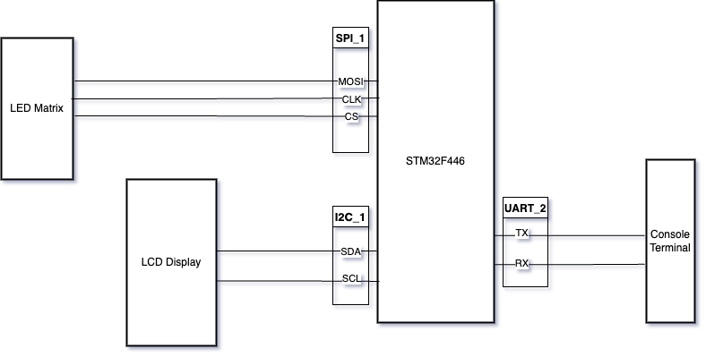

# Controlador de Matriz de LEDs

## Descripión

El controlador de matriz de LEDs consiste en un sistema para controlar una matriz de LEDs SMD RGB de manera de que marquen pulsos con colores configurables o automáticos (cambiando de color en cada pulso). La matriz está conectada por protocolo SPI.

El estado de la configuración del controlador se informa al usuario por medio de un LCD 4x20 compatible con HD44780 conectado mediante protocolo I2C. 

El cambio de la configuración de la matriz se realiza por medio de una consola serial por protocolo UART

Los comandos a los que reacciona el controlador a través de su consola serial son

- `h | H` 
Informa la configuración de conexión en la consola serial
- `1-9`
Actualiza la frecuencia de pulso entre 100 ms y 900 ms dependiendo la entrada
- `0`
Actualiza la frecuencia de pulso a 1 seg
- `a | A`
Actualiza el color de la fila de manera automática (*)
- `r | R`
Actualiza el color de la fila a rojo (*)
- `g | G`
Actualiza el color de la fila a verde (*)
- `b | B`
Actualiza el color de la fila a azul (*)
- `y | Y`
Actualiza el color de la fila a amarillo (*)
- `m | M`
Actualiza el color de la fila a magenta (*)
- `c | C`
Actualiza el color de la fila a cyan (*)
- `w | W`
Actualiza el color de la fila a blanco (*)
- `o | O` 
Actualiza la fila a apagado (*)

(*) si el comando es la letra en minúscula se actualiza la fila inferior y si es la letra en mayúscula se actualiza la fila superior

## Diagrama de bloques

## Configuraciones de los módulos utilizados

### Matriz SMP Led SPI

- Baud Rate: `10 MHz`
- mode: `MASTER`
- CPOL: `0`
- CPHA: `0`
- Bit Order: `MSB FIRST`

### LCD I2C

- Speed: `100 Khz`
- Address: `7-bit`

### Terminal Serial UART

- baud rate: `115200`
- word len: `8 bits`
- parity: `NONE`
- stop bits: `1`
